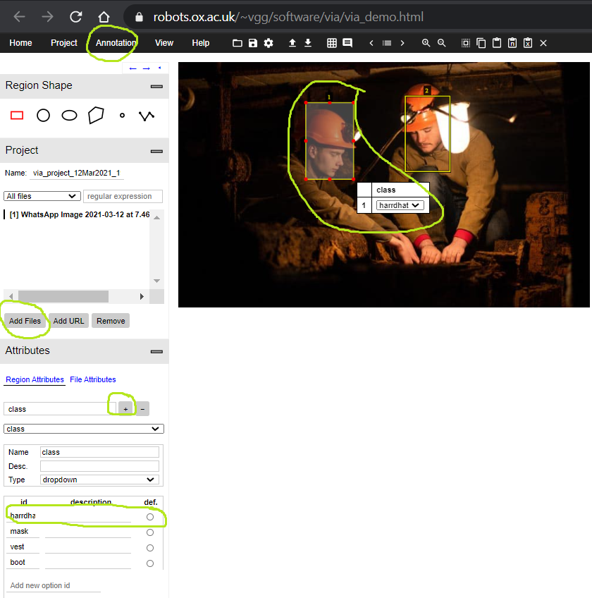
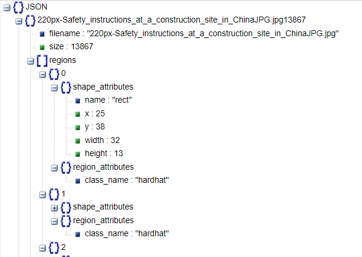

   # Annotation method

* Go to this url https://www.robots.ox.ac.uk/~vgg/software/via/via_demo.html 
* Focus on highlighted with green areas which done manually 
* Step1 : Click on add files and upload the image
* Step2 : click on uploaded image
* Step3 : Under the region attributes click on + but write a class name ,- button indicates for removal attributes which you created
* Step4 : select type as drop down
* Step5 : select enter id value such that hard hat click enter add one more id value vest..
* Step6 : Repeat above steps for each image
* Step5 : Finally use click on annotate button on top save as json click it

  
  
  # Json Structure

* https://www.robots.ox.ac.uk/~vgg/software/via/via_demo.html is used for annaotating the image.
* In Json each image name wise information will be available
* Image name attribute contains regions
* regions contains index of each box highlight eg:0,1,2,.. ,each highlight number contains shape_attributes and region_attributes
* shape_attributes contains x,y are the centroid cordinates of highlighted box, width and height of highlight box
* region_attributes contains class attributes such that highlight names such as hard hat,boot,vest,mask

